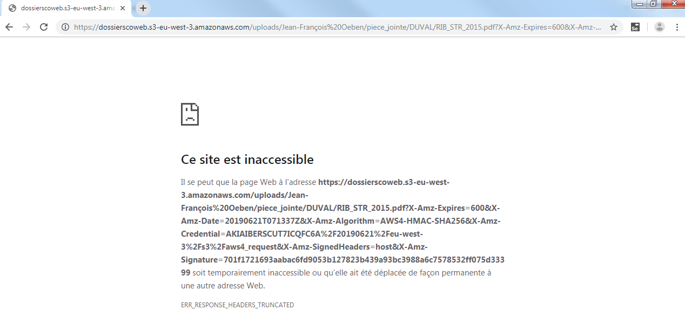

# Lecture des pièces jointes

Sur la fin de la saison 2, 

Appel de la personne du secrétariat du collège OEBEN. Le bug se reproduit sur plusieurs élèves.
Voir un élève, consulter les pièces jointes : aucune n'est lisible à l'écran lorsque je suis identifié avec mon compte. La consultation du RIB provoque l'erreur suivante :

À propos de FIREWALL (et du soucis que nous avons eu sur les pièces jointes)
blacklist centrale iut de toulouse capitole1 puis autonomie du chef d'établissement pour ajouter, supprimer des règles. DSI en support si besoin
